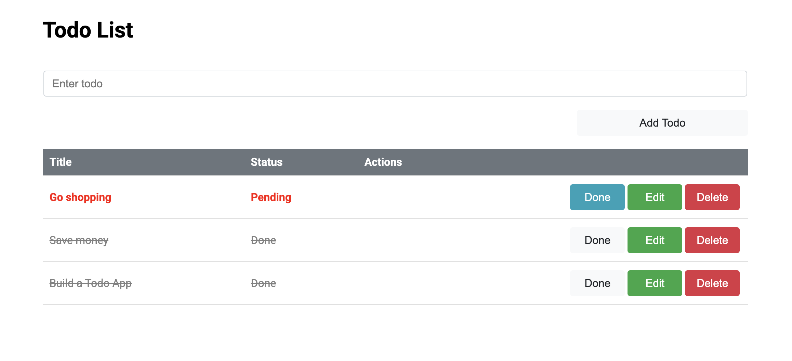

# Todo List App 📝

This is a **Todo List App** built with **Angular** and **NgRx** for efficient state management. The app allows users to **add, edit, delete, and toggle todos**, using **NgRx Actions, Reducers, Effects, and Selectors**.



## 🚀 Features

- **State Management with NgRx** (Actions, Reducers, Effects, Selectors)
- **Reactive Forms for Todo Input**
- **Standalone Components (Angular 17+)**
- **NgRx Effects for Async API Calls**
- **Selectors for Optimized State Retrieval**
- **Styled Todo Table with Edit/Delete Actions**
- **Dynamic Form Handling for Editing Todos**

## 🛠️ Technologies Used

- **Angular 19** (Standalone Components)
- **NgRx** (State Management)
- **Reactive Forms** (Form Handling)

## 📂 Project Structure

```

src/
│── app/
│ ├── todo-list/ # Todo Feature Module
│ ├── store/ # Global NgRx state management
│ │ ├── actions/ # NgRx Actions
│ │ │ ├── todo.actions.ts
│ │ ├── reducers/ # NgRx Reducers
│ │ │ ├── todo.reducer.ts
│ │ ├── effects/ # NgRx Effects (Async handling)
│ │ │ ├── todo.effects.ts
│ │ ├── selectors/ # NgRx Selectors
│ │ │ ├── todo.selectors.ts
│ │ ├── models/ # Todo Model
│ │ │ ├── todo.model.ts
│ │ ├── services/ # API Service (TodoService)
│ │ │ ├── todo.service.ts
│ │ ├── components/ # UI Components (Table, Inputs)
│── app.config.ts

```

## 🏗️ Setting Up the Project

### 1️⃣ Install Dependencies

Run the following command to install Angular and NgRx dependencies:

```bash
npm install
```

### 2️⃣ Install NgRx Store Packages (optional update)

```bash
npm install @ngrx/store @ngrx/effects @ngrx/store-devtools
```

### 3️⃣ Run the Application

```bash
ng serve
```

Then, open **http://localhost:4200** in your browser.

## 💡 Future Improvements

- ✅ **Persist Todos with an API**
- ✅ **Add Filters for Completed/Pending Todos**
- ✅ **Enhance Styling & UX with Animations**
- ✅ **Unit Testing with Jest & NgRx Mocks**

## 📜 License

This project is **open-source** under the **MIT License**.
